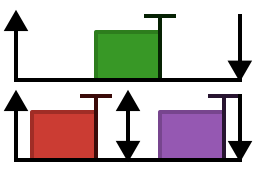

# RealTimeScheduling

Real-time systems modeling and schedulability analysis

This package aims to provide useful tools for writing schedulability studies
with Julia.  It provides basic functionality for schedulability testing,
response time analysis, schedule simulation, and schedule plotting.
It is inspired by [SchedCAT](https://github.com/brandenburg/schedcat) by Björn
Brandenburg, but is not a direct port since Julia isn't Python. 😉
